# IponGPT Technical Implementation Guide

## Table of Contents

### Overview
- [Project Overview](#overview)

### FRONT END
1. [Home Screen (HomeScreen)](#1-home-screen-homescreen)
2. [Refactor Expense Screen (AddExpenseScreen)](#2-refactor-expense-screen-addexpensescreen)
3. [Expense List Screen (ExpenseListScreen)](#3-expense-list-screen-expenselistscreen)
4. [Goals Screen (GoalsScreen)](#4-goals-screen-goalsscreen)
5. [Add/Edit Goal Screen (AddGoalScreen, EditGoalScreen)](#5-addedit-goal-screen-addgoalscreen-editgoalscreen)
6. [Challenges/Gamification Screen (ChallengesScreen, BadgesScreen)](#6-challengesgamification-screen-challengesscreen-badgesscreen)
7. [Settings Screen (SettingsScreen)](#7-settings-screen-settingsscreen)
8. [AI Coach Chat Screen (New)](#8-ai-coach-chat-screen-new)
9. [Reports/Analytics Screen (New)](#9-reportsanalytics-screen-new)
10. [Visual Design & Styling System](#10-visual-design--styling-system)

### BACK END
1. [State Management Migration (Provider → Riverpod)](#1-state-management-migration-provider--riverpod)
2. [AI Financial Coach Service](#2-ai-financial-coach-service)
3. [Security & Privacy Enhancements](#3-security--privacy-enhancements)
4. [Database Enhancements](#4-database-enhancements)
5. [Monetization System](#5-monetization-system)
6. [Voice & Photo Processing](#6-voice--photo-processing)
7. [Offline-First Architecture](#7-offline-first-architecture)
8. [Performance & Optimization](#8-performance--optimization)
9. [Frontend-Backend Communication & Data Flow](#9-frontend-backend-communication--data-flow)

### PROJECT MANAGEMENT
- [Implementation Timeline](#implementation-timeline)
- [Testing Strategy](#testing-strategy)

---

## Overview
This document provides detailed technical implementation steps for transforming PesoTracker into IponGPT, organized by Front End (UI screens) and Back End (technical infrastructure) components.

---

# FRONT END

## 1. Home Screen (HomeScreen)

### Current Layout:
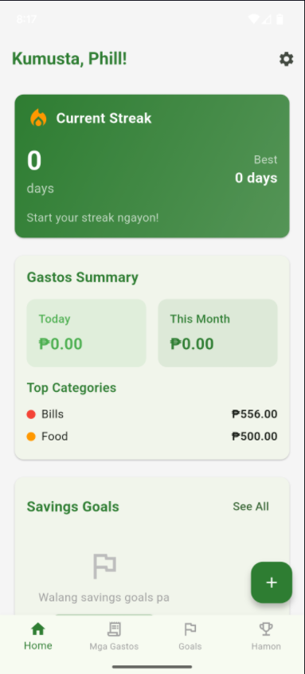

### Current Features:
- Basic greeting with user name ("Kumusta, Phill!")
- Current Streak card with flame icon showing 0 days and best streak
- Gastos Summary section with Today/This Month totals (₱0.00)
- Top Categories breakdown (Bills: ₱556.00, Food: ₱500.00)
- Savings Goals preview with "Walang savings goals pa" message
- Bottom navigation with Home, Mga Gastos, Goals, Hamon tabs
- Green floating "+" button for adding new items
- Settings gear icon in top right

### Proposed UI Changes:
- **Add prominent "+" button in center** for quick Money In/Money Out entry → [Implementation Details](FRONTEND_IMPLEMENTATION_DETAILS.md#11-add-prominent--button-in-center-for-quick-money-inmoney-out-entry)
- **Multiple wallet selector** at top (Cash, Card, VPS, etc.) with balance display → [Implementation Details](FRONTEND_IMPLEMENTATION_DETAILS.md#12-implement-multiple-wallet-selector-with-balance-display)
- **Enhanced streak visualization** with possible animations and/or confetti → [Implementation Details](FRONTEND_IMPLEMENTATION_DETAILS.md#13-create-enhanced-streak-visualization-with-animations)
- **Total balance display** prominently at top with hide/show toggle → [Implementation Details](FRONTEND_IMPLEMENTATION_DETAILS.md#14-add-total-balance-display-with-hideshow-toggle)
- **Money Insider section** showing visual spending trends with mini charts → [Implementation Details](FRONTEND_IMPLEMENTATION_DETAILS.md#15-implement-money-insider-section-with-mini-charts)
- **AI Coach floating icon** for quick access to financial advisor → [Implementation Details](FRONTEND_IMPLEMENTATION_DETAILS.md#16-add-ai-coach-floating-icon-for-quick-access)
- **Cultural motivational phrases** below sections ("Konting tiis, Josh! Ipon na malapit na!") → [Implementation Details](FRONTEND_IMPLEMENTATION_DETAILS.md#17-integrate-cultural-motivational-phrases)
- **Enhanced visual design** with thermometer-style progress bars → [Implementation Details](FRONTEND_IMPLEMENTATION_DETAILS.md#18-create-thermometer-style-progress-bars)
- **Quick action cards** for common tasks (Add Expense, Check Goals, View Challenges) → [Implementation Details](FRONTEND_IMPLEMENTATION_DETAILS.md#19-implement-quick-action-cards-for-common-tasks)

### Implementation Details:
```dart
// New wallet selector widget
class WalletSelector extends StatelessWidget {
  final List<Wallet> wallets;
  final Wallet selectedWallet;
  final Function(Wallet) onWalletChanged;
  
  // Displays horizontal scrolling wallet cards
  // Shows balance for each wallet
  // Allows quick switching between wallets
}

// Enhanced streak visualization
class EnhancedStreakCard extends StatefulWidget {
  // Animated flame icons
  // Confetti animation on streak milestones
  // Best streak tracking display
  // Progress towards next milestone
}

// Money Insider mini charts
class SpendingTrendsWidget extends StatelessWidget {
  // Mini pie chart for category breakdown
  // Weekly spending line graph
  // Comparison with previous period
}
```

---

## 2. Refactor Expense Screen (AddExpenseScreen)

### Current Layout:
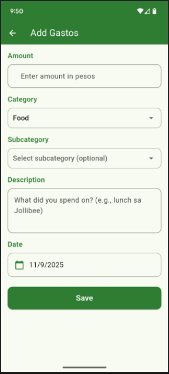

### Current Features:
- Amount input field
- Category dropdown selection
- Subcategory selection
- Description text field
- Date picker
- Form validation
- Basic expense creation
- restricted to expense only. 

### Proposed UI Changes:
- **Unified Money In/Money Out tabs** in single screen and call the page "Transactions" → [Implementation Details](FRONTEND_IMPLEMENTATION_DETAILS.md#21-create-unified-money-inmoney-out-tabs)

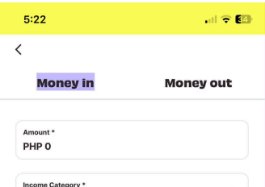
- **Voice input button** with "Nag-spend ako ng ₱50 sa breakfast" support → [Implementation Details](FRONTEND_IMPLEMENTATION_DETAILS.md#22-add-voice-input-button-with-filipino-phrase-support)
- **Photo receipt capture** button with auto-categorization preview → [Implementation Details](FRONTEND_IMPLEMENTATION_DETAILS.md#23-implement-photo-receipt-capture-with-auto-categorization)
- **Filipino-specific categories** → [Implementation Details](FRONTEND_IMPLEMENTATION_DETAILS.md#24-create-filipino-specific-categories-system):
  - Pagkain, Transportasyon (Jeep/Bus/MRT/LRT/Trike)
  - Bills (Kuryente/Tubig/Internet/Load)
  - Shopping (Grocery, Damit)
  - Entertainment (Movies, Gimik, Inuman)

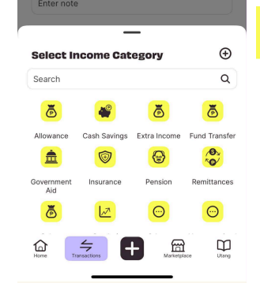
- **Recurring transaction toggle** with frequency options → [Implementation Details](FRONTEND_IMPLEMENTATION_DETAILS.md#25-add-recurring-transaction-toggle-with-frequency-options)
- **Location-based hints** (optional) for common places → [Implementation Details](FRONTEND_IMPLEMENTATION_DETAILS.md#26-implement-location-based-hints-feature)
- **Quick amount buttons** (₱20, ₱50, ₱100, ₱200) → [Implementation Details](FRONTEND_IMPLEMENTATION_DETAILS.md#27-add-quick-amount-buttons-for-common-values)
- **Recent transactions suggestions** for faster entry → [Implementation Details](FRONTEND_IMPLEMENTATION_DETAILS.md#28-create-recent-transactions-suggestions-system)
- **Wallet selection** integrated into the form → [Implementation Details](FRONTEND_IMPLEMENTATION_DETAILS.md#29-integrate-wallet-selection-into-form)

### Implementation Details:
```dart
class UnifiedTransactionEntry extends StatefulWidget {
  // TabBar for Money In/Money Out
  // Voice recognition integration
  // Camera integration for receipt capture
  // ML-based category suggestion from photos
}

class VoiceInputWidget extends StatefulWidget {
  // Speech-to-text integration
  // Natural language processing for Filipino phrases
  // Automatic amount and category extraction
}

class PhotoReceiptCapture extends StatefulWidget {
  // Camera integration
  // OCR for text extraction from receipts
  // Smart category suggestion based on merchant
}
```

---

## 3. Expense List Screen (ExpenseListScreen)

### Current Layout:
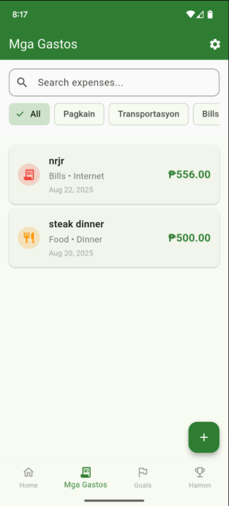

### Current Features:
- "Mga Gastos" title with settings icon
- Search bar with "Search expenses..." placeholder
- Category filter tabs (All, Pagkain, Transportasyon, Bills)
- Expense cards showing:
  - Category icons (Bills with calendar icon, Food with utensils icon)
  - Expense description and category type
  - Amount in green (₱556.00, ₱500.00)
  - Date timestamps (Aug 22, 2025, Aug 20, 2025)
- Green floating "+" button for adding expenses
- Bottom navigation

### Proposed UI Changes:
- **Visual category icons** instead of text labels → [Implementation Details](FRONTEND_IMPLEMENTATION_DETAILS.md#31-replace-text-labels-with-visual-category-icons)
- **Enhanced expense cards** with merchant logos/icons → [Implementation Details](FRONTEND_IMPLEMENTATION_DETAILS.md#32-enhance-expense-cards-with-merchant-logosicons)
- **Swipe actions** for quick edit/delete/duplicate → [Implementation Details](FRONTEND_IMPLEMENTATION_DETAILS.md#33-add-swipe-actions-for-quick-editdeleteduplicate)
- **Advanced filtering** by category, date range, amount → [Implementation Details](FRONTEND_IMPLEMENTATION_DETAILS.md#34-implement-advanced-filtering-system)
- **Search functionality** with smart suggestions → [Implementation Details](FRONTEND_IMPLEMENTATION_DETAILS.md#35-add-search-functionality-with-smart-suggestions)
- **Visual spending patterns** with mini charts per category → [Implementation Details](FRONTEND_IMPLEMENTATION_DETAILS.md#36-create-visual-spending-patterns-with-mini-charts)
- **Bulk operations** (select multiple, bulk delete/edit) → [Implementation Details](FRONTEND_IMPLEMENTATION_DETAILS.md#37-implement-bulk-operations-feature)
- **Receipt photos** displayed as thumbnails on cards → [Implementation Details](FRONTEND_IMPLEMENTATION_DETAILS.md#38-add-receipt-photos-as-thumbnails-on-cards)
- **Quick stats bar** showing total, average, highest expense → [Implementation Details](FRONTEND_IMPLEMENTATION_DETAILS.md#39-create-quick-stats-bar-with-totals-and-averages)

### Implementation Details:
```dart
class EnhancedExpenseCard extends StatelessWidget {
  // Category icons and colors
  // Receipt photo thumbnails
  // Swipe action buttons
  // Visual amount highlighting
}

class ExpenseFilterSheet extends StatefulWidget {
  // Date range picker
  // Category multi-select
  // Amount range slider
  // Saved filter presets
}
```

---

## 4. Goals Screen (GoalsScreen)

### Current Layout:
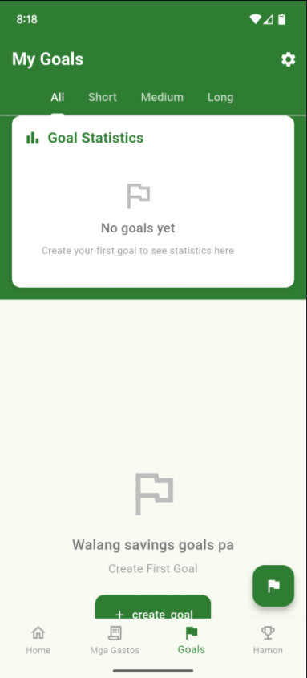

### Current Features:
- "My Goals" title with settings icon
- Goal duration tabs (All, Short, Medium, Long)
- Goal Statistics card with empty state message
- "No goals yet" placeholder with folder icon
- "Create your first goal to see statistics here" instruction
- "Walang savings goals pa" message at bottom
- "Create First Goal" text
- Green "+ create goal" button at bottom
- Green floating flag icon button
- Bottom navigation with Goals tab highlighted

### Proposed UI Changes:
- **Goal templates** with preset options (Phone, Baguio trip, emergency fund, tuition) → [Implementation Details](FRONTEND_IMPLEMENTATION_DETAILS.md#41-create-goal-templates-with-preset-options)
- **Thermometer-style progress bars** with milestone animations → [Implementation Details](FRONTEND_IMPLEMENTATION_DETAILS.md#42-implement-thermometer-style-progress-bars-with-animations)
- **Visual progress indicators** with confetti on achievements → [Implementation Details](FRONTEND_IMPLEMENTATION_DETAILS.md#43-add-visual-progress-indicators-with-milestone-celebrations)
- **Social sharing buttons** ("I'm 50% closer to my Siargao trip!") → [Implementation Details](FRONTEND_IMPLEMENTATION_DETAILS.md#44-create-social-sharing-buttons-for-achievements)
- **Timeline calculators** showing projected completion dates → [Implementation Details](FRONTEND_IMPLEMENTATION_DETAILS.md#45-add-timeline-calculators-for-completion-dates)
- **Goal categories** with different visual themes → [Implementation Details](FRONTEND_IMPLEMENTATION_DETAILS.md#46-implement-goal-categories-with-visual-themes)
- **Quick contribute button** for easy progress updates → [Implementation Details](FRONTEND_IMPLEMENTATION_DETAILS.md#47-add-quick-contribute-button-for-progress-updates)
- **Achievement badges** for completed goals → [Implementation Details](FRONTEND_IMPLEMENTATION_DETAILS.md#48-create-achievement-badges-for-completed-goals)
- **Progress photos** option to add visual motivation → [Implementation Details](FRONTEND_IMPLEMENTATION_DETAILS.md#49-add-progress-photos-option-for-visual-motivation)

### Implementation Details:
```dart
class ThermometerProgressBar extends StatefulWidget {
  // Animated filling effect
  // Milestone markers
  // Confetti animation on milestones
}

class GoalTemplateSelector extends StatelessWidget {
  // Predefined goal templates
  // Visual template cards
  // Smart default amounts and timelines
}

class SocialShareButton extends StatelessWidget {
  // Integration with social platforms
  // Custom share images
  // Progress celebration messages
}
```

---

## 5. Add/Edit Goal Screen (AddGoalScreen, EditGoalScreen)

### Current Layout:
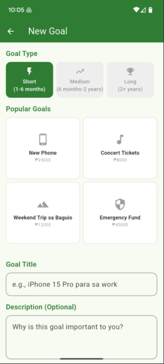

### Current Features:
- Goal type selection
- Popular Goal types
- Goal name input
- Goal Description
- Target amount input
- Target date picker
- Basic form validation

### Proposed UI Changes:
- **Visual goal type selection** with icons and descriptions → [Implementation Details](FRONTEND_IMPLEMENTATION_DETAILS.md#51-implement-visual-goal-type-selection-with-icons)
- **Smart amount suggestions** based on goal type → [Implementation Details](FRONTEND_IMPLEMENTATION_DETAILS.md#52-add-smart-amount-suggestions-based-on-goal-type)
- **Timeline calculator** showing required daily/weekly savings → [Implementation Details](FRONTEND_IMPLEMENTATION_DETAILS.md#53-create-timeline-calculator-for-required-savings)
- **Visual progress preview** of what the completed goal will look like → [Implementation Details](FRONTEND_IMPLEMENTATION_DETAILS.md#54-add-visual-progress-preview-feature)
- **Motivation image upload** for personal goal visualization → [Implementation Details](FRONTEND_IMPLEMENTATION_DETAILS.md#55-implement-motivation-image-upload-feature)
- **Sub-goals creation** for large goals broken into milestones → [Implementation Details](FRONTEND_IMPLEMENTATION_DETAILS.md#56-create-sub-goals-for-large-objectives)
- **Reminder notifications** setup for regular contributions → [Implementation Details](FRONTEND_IMPLEMENTATION_DETAILS.md#57-add-reminder-notifications-setup)

### Implementation Details:
```dart
class GoalTypeSelector extends StatelessWidget {
  // Visual grid of goal types
  // Icons and descriptions
  // Smart defaults for each type
}

class TimelineCalculator extends StatefulWidget {
  // Interactive calculations
  // Visual timeline display
  // Adjustment sliders for flexibility
}
```

---

## 6. Challenges/Gamification Screen (ChallengesScreen, BadgesScreen)

### Current Layout:
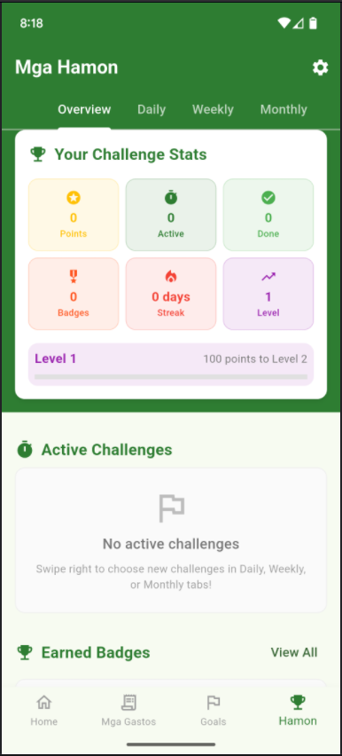

### Current Features:
- "Mga Hamon" (Challenges) title with settings icon
- Challenge period tabs (Overview, Daily, Weekly, Monthly)
- Your Challenge Stats section with colored stat cards:
  - Points: 0 (yellow with star icon)
  - Active: 0 (green with info icon)
  - Done: 0 (green with checkmark icon)
  - Badges: 0 (red with badge icon)
  - Streak: 0 days (red with flame icon)
  - Level: 1 (purple with trend icon)
- Level progress bar showing "Level 1" and "100 points to Level 2"
- Active Challenges section with empty state
- "No active challenges" message with folder icon
- Instructions to "Swipe right to choose new challenges in Daily, Weekly, or Monthly tabs"
- Earned Badges section with "View All" link
- Bottom navigation with Hamon (trophy icon) tab highlighted

### Proposed UI Changes:
- **Enhanced challenge cards** with Filipino-themed designs → [Implementation Details](FRONTEND_IMPLEMENTATION_DETAILS.md#61-create-enhanced-challenge-cards-with-filipino-themes)
- **Passive challenge tracking** with automatic enrollment → [Implementation Details](FRONTEND_IMPLEMENTATION_DETAILS.md#62-implement-passive-challenge-tracking-system)
- **Challenge types** → [Implementation Details](FRONTEND_IMPLEMENTATION_DETAILS.md#63-add-filipino-challenge-types):
  - Tipid Tuesday, No Kape, Baon Lang
  - Jeepney Mode, Week-long Saver
  - Receipt Warrior, Masinop na Pinoy, Ipon Master
- **Community leaderboards** (Barangay/barkada/family competitions) → [Implementation Details](FRONTEND_IMPLEMENTATION_DETAILS.md#64-add-community-leaderboards-feature)
- **Visual progress tracking** with animated progress bars → [Implementation Details](FRONTEND_IMPLEMENTATION_DETAILS.md#65-create-visual-progress-tracking-with-animations)
- **Achievement celebrations** with confetti and sound effects → [Implementation Details](FRONTEND_IMPLEMENTATION_DETAILS.md#66-implement-achievement-celebrations-with-effects)
- **Challenge history** showing completed challenges → [Implementation Details](FRONTEND_IMPLEMENTATION_DETAILS.md#67-add-challenge-history-display)
- **Social features** for sharing achievements → [Implementation Details](FRONTEND_IMPLEMENTATION_DETAILS.md#68-create-social-features-for-sharing-achievements)

### Implementation Details:
```dart
class FilipinoChallengeCard extends StatefulWidget {
  // Cultural theming and colors
  // Progress animations
  // Community ranking display
}

class LeaderboardWidget extends StatelessWidget {
  // Community rankings
  // Friend/family comparisons
  // Achievement showcases
}
```

---

## 7. Settings Screen (SettingsScreen)

### Current Layout:
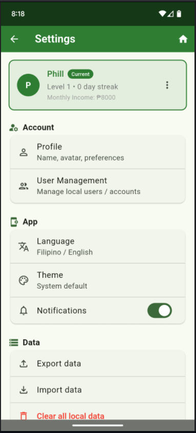

### Current Features:
- "Settings" title with back arrow and home icon
- User profile card showing:
  - User avatar ("P" in green circle)
  - Name ("Phill") with "Current" badge
  - Level and streak ("Level 1 • 0 day streak")
  - Monthly Income ("Monthly Income: ₱8000")
  - Three-dot menu option
- Account section with:
  - Profile option ("Name, avatar, preferences")
  - User Management ("Manage local users / accounts")
- App section with:
  - Language setting ("Filipino / English")
  - Theme setting ("System default")
  - Notifications toggle (enabled - green switch)
- Data section with:
  - Export data option
  - Import data option
  - Clear all local data (in red text)

### Proposed UI Changes:
- **Enhanced privacy controls** with clear explanations → [Implementation Details](FRONTEND_IMPLEMENTATION_DETAILS.md#71-enhance-privacy-controls-with-clear-explanations)
- **Security settings** (biometric/PIN setup) → [Implementation Details](FRONTEND_IMPLEMENTATION_DETAILS.md#72-add-security-settings-with-biometricpin-setup)
- **Notification preferences** with granular controls → [Implementation Details](FRONTEND_IMPLEMENTATION_DETAILS.md#73-create-granular-notification-preferences)
- **Data management** (export, backup, delete options) → [Implementation Details](FRONTEND_IMPLEMENTATION_DETAILS.md#74-implement-data-management-features)
- **Premium upgrade** section with feature comparisons → [Implementation Details](FRONTEND_IMPLEMENTATION_DETAILS.md#75-add-premium-upgrade-section)
- **AI Coach settings** (personality, language preference) → [Implementation Details](FRONTEND_IMPLEMENTATION_DETAILS.md#76-create-ai-coach-settings-panel)
- **Wallet management** for multiple accounts → [Implementation Details](FRONTEND_IMPLEMENTATION_DETAILS.md#77-implement-wallet-management-system)
- **Cultural preferences** (Taglish level, regional dialects) → [Implementation Details](FRONTEND_IMPLEMENTATION_DETAILS.md#78-add-cultural-preferences-options)

### Implementation Details:
```dart
class PrivacyControlPanel extends StatefulWidget {
  // Toggle switches for each privacy setting
  // Clear explanations of data usage
  // Easy export/delete options
}

class SecuritySetupScreen extends StatefulWidget {
  // Biometric authentication setup
  // PIN creation and confirmation
  // Security level indicators
}
```

---

## 8. AI Coach Chat Screen (New)

### Current Features:
- Not implemented

### Proposed UI Changes:
- **Chat interface** with conversational AI → [Implementation Details](FRONTEND_IMPLEMENTATION_DETAILS.md#81-create-chat-interface-with-conversational-ai)
- **Quick action chips** for common questions → [Implementation Details](FRONTEND_IMPLEMENTATION_DETAILS.md#82-add-quick-action-chips-for-common-questions)
- **Taglish support** with language mixing → [Implementation Details](FRONTEND_IMPLEMENTATION_DETAILS.md#83-implement-taglish-support-with-language-mixing)
- **Contextual advice** based on spending patterns → [Implementation Details](FRONTEND_IMPLEMENTATION_DETAILS.md#84-create-contextual-advice-based-on-spending-patterns)
- **Visual insights** with charts and graphs in chat → [Implementation Details](FRONTEND_IMPLEMENTATION_DETAILS.md#85-add-visual-insights-with-charts-in-chat)
- **Voice interaction** option for hands-free use → [Implementation Details](FRONTEND_IMPLEMENTATION_DETAILS.md#86-implement-voice-interaction-option)
- **Smart suggestions** based on financial behavior → [Implementation Details](FRONTEND_IMPLEMENTATION_DETAILS.md#87-create-smart-suggestions-based-on-behavior)
- **Educational content** delivery through conversations → [Implementation Details](FRONTEND_IMPLEMENTATION_DETAILS.md#88-add-educational-content-delivery-system)

### Implementation Details:
```dart
class AICoachChatScreen extends StatefulWidget {
  // Chat bubble UI
  // Quick action buttons
  // Voice input/output integration
  // Contextual response generation
}

class ChatBubble extends StatelessWidget {
  // Different styles for user/AI messages
  // Rich content support (charts, images)
  // Timestamp and status indicators
}

class QuickActionChips extends StatelessWidget {
  // Predefined question buttons
  // Context-aware suggestions
  // Popular query shortcuts
}
```

---

## 9. Reports/Analytics Screen (New)

### Current Features:
- Basic expense summaries

### Proposed UI Changes:
- **Visual charts** (pie/bar/line charts for categories) → [Implementation Details](FRONTEND_IMPLEMENTATION_DETAILS.md#91-create-visual-charts-for-category-analysis)

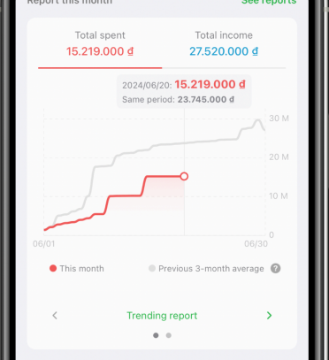
- **Trend analysis** with time period comparisons → [Implementation Details](FRONTEND_IMPLEMENTATION_DETAILS.md#92-implement-trend-analysis-with-time-comparisons)
- **Story-style recaps** with Filipino context → [Implementation Details](FRONTEND_IMPLEMENTATION_DETAILS.md#93-add-story-style-recaps-with-filipino-context)
- **Spending pattern insights** with recommendations → [Implementation Details](FRONTEND_IMPLEMENTATION_DETAILS.md#94-create-spending-pattern-insights-with-recommendations)
- **Goal progress analytics** with projections → [Implementation Details](FRONTEND_IMPLEMENTATION_DETAILS.md#95-implement-goal-progress-analytics-with-projections)
- **Export options** (CSV, PDF for premium users) → [Implementation Details](FRONTEND_IMPLEMENTATION_DETAILS.md#96-add-export-options-for-data)
- **Comparative analysis** (month-over-month, year-over-year) → [Implementation Details](FRONTEND_IMPLEMENTATION_DETAILS.md#97-create-comparative-analysis-features)

### Implementation Details:
```dart
class InteractiveChartWidget extends StatefulWidget {
  // Multiple chart types
  // Touch interactions
  // Drill-down capabilities
}

class SpendingInsightsCard extends StatelessWidget {
  // AI-generated insights
  // Actionable recommendations
  // Cultural context integration
}
```

---

## 10. Visual Design & Styling System

### Overview:
IponGPT follows a **Filipino-centric design philosophy** that combines modern Material Design principles with cultural elements, warm colors, and familiar visual language that resonates with Filipino users. The design system ensures consistency across all screens while maintaining accessibility and performance.

### Color Palette:
#### **Primary Colors:**
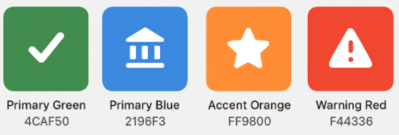
- **Primary Green**: `#4CAF50` (Success, money growth, prosperity)
- **Primary Blue**: `#2196F3` (Trust, stability, banking)
- **Accent Orange**: `#FF9800` (Energy, motivation, achievements)
- **Warning Red**: `#F44336` (Overspending, alerts, critical actions)

#### **Secondary Colors:**
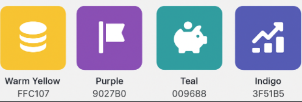
- **Warm Yellow**: `#FFC107` (Gold, coins, rewards, premium features)
- **Purple**: `#9C27B0` (Goals, dreams, aspirations)
- **Teal**: `#009688` (Savings, calm financial decisions)
- **Indigo**: `#3F51B5` (Analytics, data, intelligence)

#### **Neutral Colors:**
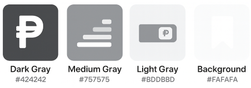
- **Dark Gray**: `#424242` (Primary text, headers)
- **Medium Gray**: `#757575` (Secondary text, subtitles)  
- **Light Gray**: `#BDBDBD` (Disabled elements, dividers)
- **Background**: `#FAFAFA` (App background)
- **Card Background**: `#FFFFFF` (Content cards, forms)

#### **Cultural Colors:**
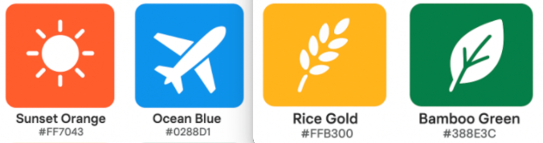
- **Sunset Orange**: `#FF7043` (Filipino sunsets, warmth)
- **Ocean Blue**: `#0288D1` (Philippine seas, travel goals)
- **Rice Gold**: `#FFB300` (Prosperity, harvest, abundance)
- **Bamboo Green**: `#388E3C` (Nature, sustainability, growth)

### Typography System:
#### **Font Families:**
- **Primary**: Inter (Clean, modern, highly readable)
- **Secondary**: Nunito Sans (Friendly, approachable for Filipino text)
- **Display**: Poppins (Bold headers, prominent displays)
- **Monospace**: JetBrains Mono (Numbers, amounts, data)

#### **Text Styles:**
- **Display Large**: 32px, Bold, Poppins (Screen titles, major amounts)
- **Headline**: 24px, SemiBold, Inter (Section headers, card titles)
- **Title**: 20px, Medium, Inter (Expense items, goal names)
- **Body**: 16px, Regular, Inter (Descriptions, content)
- **Caption**: 14px, Regular, Nunito Sans (Helper text, timestamps)
- **Label**: 12px, Medium, Inter (Form labels, categories)

#### **Filipino Text Considerations:**
- **Taglish Support**: Mixed English-Filipino text spacing
- **Long Category Names**: Ellipsis handling for "Transportasyon"
- **Cultural Phrases**: Proper spacing for motivational text
- **Peso Currency**: Special formatting for ₱ symbol integration

### Iconography System:
#### **Icon Styles:**
- **Style**: Material Icons + Custom Filipino-themed icons
- **Weight**: 400 (Regular) for most UI elements
- **Size Standards**: 16px, 20px, 24px, 32px, 48px
- **Format**: SVG for scalability, PNG fallbacks for complex icons

#### **Category Icons:**
- **Food & Dining**: 🍽️ Fork/knife, Rice bowl, Jeepney food cart
- **Transportation**: 🚌 Jeepney, MRT train, Tricycle, Bus
- **Shopping**: 🛒 Shopping bag, SM Mall icon, Market basket
- **Bills & Utilities**: ⚡ Lightning bolt, House, WiFi symbol
- **Healthcare**: 🏥 Cross, Stethoscope, Medicine bottle
- **Entertainment**: 🎬 Movie camera, Karaoke mic, Festival
- **Education**: 📚 Books, Graduation cap, School building
- **Savings & Investment**: 💰 Piggy bank, Growth chart, Coins

#### **Custom Filipino Icons:**
- **Jeepney**: Stylized side-view jeepney for transportation
- **Sari-sari Store**: Small store front for shopping category
- **Bahay Kubo**: Traditional house for home/rent expenses
- **Bangus**: Fish icon for food category
- **Coconut**: Tropical element for savings/goals
- **Philippine Flag Colors**: Integrated in achievement badges

### Visual Components:
#### **Cards & Containers:**
- **Border Radius**: 12px (Rounded, friendly appearance)
- **Elevation**: Material Design shadow levels (2dp, 4dp, 8dp)
- **Padding**: 16px standard, 24px for major containers
- **Margin**: 8px between items, 16px screen edges

#### **Progress Indicators:**
- **Thermometer Style**: Vertical progress for savings goals
- **Circular Progress**: Radial progress for challenges
- **Linear Progress**: Horizontal bars for category spending
- **Color Gradient**: Green to yellow to red based on progress

#### **Buttons & Actions:**
- **Primary Button**: Rounded corners, 48dp height, bold text
- **Secondary Button**: Outlined style with primary color border
- **Floating Action Button**: 56dp diameter, prominent shadow
- **Icon Button**: 40dp touch target, 24dp icon

### Animation System:
#### **Micro-Interactions:**
- **Button Press**: 150ms scale down (0.95x) with bounce
- **Card Tap**: 200ms elevation increase + subtle scale
- **Success Actions**: Confetti animation for achievements
- **Error States**: Gentle shake animation (3 cycles, 4px)

#### **Page Transitions:**
- **Forward Navigation**: Slide from right (300ms)
- **Back Navigation**: Slide to right (250ms) 
- **Modal Appearance**: Fade in + scale up (400ms)
- **Bottom Sheets**: Slide up from bottom (350ms)

#### **Content Animations:**
- **List Items**: Staggered fade-in (50ms delays)
- **Charts**: Progressive draw animation (800ms)
- **Progress Bars**: Smooth fill animation (600ms)
- **Streak Flames**: Flickering animation for active streaks

#### **Cultural Animations:**
- **Achievement Celebrations**: Filipino-themed confetti colors
- **Goal Completion**: Fireworks with Philippine flag colors
- **Streak Milestones**: Tropical particle effects
- **Loading States**: Peso coin spinning animation

### Cultural Design Elements:
#### **Filipino Visual Language:**
- **Warm Color Temperature**: Slightly warmer tones throughout
- **Rounded Corners**: Friendly, approachable appearance
- **Organic Shapes**: Subtle curves inspired by nature
- **Celebration Elements**: Festive colors for achievements

#### **Cultural Motifs:**
- **Geometric Patterns**: Subtle background patterns inspired by traditional weaving
- **Natural Elements**: Coconut palm, ocean waves in illustrations
- **Architectural Elements**: Bahay kubo silhouettes for backgrounds
- **Festival Colors**: Bright, celebratory colors for special occasions

### Accessibility Considerations:
#### **Color Accessibility:**
- **WCAG AA Compliance**: 4.5:1 contrast ratio for normal text
- **Color Blindness**: Use icons + text, not just color coding
- **High Contrast Mode**: Alternative color scheme support
- **Dark Mode**: Complete dark theme variant

#### **Typography Accessibility:**
- **Minimum Font Size**: 14px for body text
- **Line Height**: 1.5x for optimal readability
- **Touch Targets**: Minimum 44dp for interactive elements
- **Focus Indicators**: Clear visual focus states

#### **Motion Accessibility:**
- **Reduced Motion**: Respect system accessibility settings
- **Alternative Indicators**: Static alternatives to animations
- **Duration Control**: Configurable animation speeds
- **Pause Options**: Ability to pause decorative animations

### Implementation Guidelines:
#### **Theme Structure:**
```dart
// Material Theme Configuration
ThemeData(
  primarySwatch: MaterialColor(0xFF4CAF50, {
    50: Color(0xFFE8F5E8),
    100: Color(0xFFC8E6C9),
    // ... color variants
  }),
  colorScheme: ColorScheme.fromSeed(
    seedColor: Color(0xFF4CAF50),
    brightness: Brightness.light,
  ),
  typography: Typography.material2021(),
  cardTheme: CardTheme(
    elevation: 2,
    shape: RoundedRectangleBorder(
      borderRadius: BorderRadius.circular(12),
    ),
  ),
)
```

#### **Design Tokens:**
- **Spacing Scale**: 4px, 8px, 12px, 16px, 20px, 24px, 32px, 48px
- **Corner Radius**: 4px, 8px, 12px, 16px, 24px
- **Elevation Levels**: 0dp, 2dp, 4dp, 6dp, 8dp, 12dp, 16dp, 24dp

#### **Asset Organization:**
```
assets/
├── icons/
│   ├── categories/          # Category-specific icons
│   ├── filipino/           # Cultural icons
│   └── ui/                 # Interface icons
├── images/
│   ├── illustrations/      # Onboarding, empty states
│   ├── backgrounds/        # Pattern backgrounds
│   └── achievements/       # Badge and trophy images
└── animations/
    ├── lottie/            # Complex animations
    └── rive/              # Interactive animations
```

### Platform Adaptations:
#### **iOS-Specific Adjustments:**
- **SF Symbols**: Use iOS system icons where appropriate
- **Navigation**: iOS-style back button behavior
- **Haptics**: iOS Taptic Engine feedback patterns
- **Safe Areas**: Proper notch and home indicator handling

#### **Android-Specific Adjustments:**
- **Material You**: Dynamic color support for Android 12+
- **Navigation**: Android back gesture handling
- **Haptics**: Android vibration patterns
- **Edge-to-Edge**: Proper status bar and navigation bar handling

### Future Enhancements:
#### **Planned Additions:**
- **Seasonal Themes**: Holiday-specific color variations
- **Regional Customization**: Different cultural motifs for Luzon, Visayas, Mindanao
- **Personal Themes**: User-customizable accent colors
- **Accessibility Themes**: High contrast and colorblind-friendly variants

→ **[Detailed Style Guide](STYLE_IMPLEMENTATION_DETAILS.md)**: Comprehensive design system documentation with code examples, asset specifications, and implementation guidelines.

---

# BACK END

## 1. State Management Migration (Provider → Riverpod)

### Overview:
Migrate from Provider to Riverpod for improved compile-time safety, better testing, and more flexible dependency injection. Riverpod eliminates BuildContext dependency and provides better error handling.

### Key Benefits:
- Compile-time safety prevents runtime provider errors
- Enhanced testing capabilities with easier mocking
- Automatic disposal and better memory management
- Support for computed states and complex dependency graphs

→ [Detailed Implementation Guide](BACKEND_IMPLEMENTATION_DETAILS_PART1.md#1-state-management-migration-provider--riverpod)

---

## 2. AI Financial Coach Service

### Overview:
Implement a hybrid AI financial coach that starts with rule-based coaching for MVP and supports future integration with cloud AI services for enhanced personalization and natural language processing.

### Key Features:
- **Rule-based coaching system** for immediate deployment without external dependencies
- **Hybrid architecture** supporting local + cloud AI integration
- **Multi-language support** (English, Filipino, Taglish) with cultural context
- **Natural language query processing** for conversational interactions
- **Contextual financial advice** based on spending patterns and goals
- **Daily nudges and reminders** with personalized messaging
- **Pattern recognition** for overspending alerts and behavioral insights

### Cloud AI Integration (Future Enhancement):
- **OpenAI GPT integration** for conversational AI and natural language understanding
- **Enhanced personalization** through machine learning analysis of spending patterns
- **Predictive analytics** for expense forecasting and financial planning
- **Advanced receipt processing** using OCR and text analysis
- **Filipino language models** for better cultural context and Taglish support

### Cost Considerations:
**OpenAI API Pricing** (as of 2024):
- GPT-3.5 Turbo: $0.0005 per 1K input tokens, $0.0015 per 1K output tokens
- GPT-4: $0.01 per 1K input tokens, $0.03 per 1K output tokens

**Usage Estimates for IponGPT**:
- **Average advice request**: ~200 input tokens, ~150 output tokens
- **GPT-3.5 cost per advice**: ~$0.0004 USD (₱0.022)
- **Monthly cost per active user**: ~₱6.60 (300 advice requests/month)
- **10K active users**: ~₱66,000/month
- **50K active users**: ~₱330,000/month

**Cost Scaling Visualization**:
```
Monthly Cloud AI Costs (₱)

₱700K |                                     
₱600K |                                      
₱500K |                              +           
₱400K |                      +                   
₱300K |             +                         
₱200K |        +                               
₱100K |   +                                    
   ₱0 |------------------------------------------
       0    5K   10K   25K   50K   100K   |  Users

      
Per User: ₱6.60/month
Break-even at ₱299/month premium subscription
```

**Required Accounts & Setup**:
- OpenAI API account with payment method
- API key management and secure storage
- Usage monitoring and rate limiting
- Fallback systems for API failures

**Philippines-Specific Considerations**:
- **API Latency**: 200-400ms additional latency from PH to US servers
- **Network Reliability**: Intermittent connectivity requires robust fallback
- **Currency Exchange**: USD pricing affected by PHP exchange rates
- **Data Residency**: No local data processing requirements for financial advice
- **Regulatory Compliance**: BSP guidelines on AI usage in financial services

**Risk Mitigation**:
- **Freemium Model**: Cloud AI features for premium subscribers only
- **Usage Limits**: Daily/monthly caps per user to control costs
- **Local Fallback**: All functionality works offline without cloud dependency
- **Cost Monitoring**: Real-time usage tracking with automatic shutoffs
- **Regional CDN**: Consider Azure/AWS Asia-Pacific regions for lower latency

### Alternative AI API Services:

**Google Cloud AI Platform**:
- **Pricing**: $0.0005-$0.002 per 1K tokens (similar to OpenAI)
- **Advantages**: Better Asia-Pacific coverage, Vertex AI for custom models
- **Filipino Support**: Limited, but supports custom language models
- **Latency**: ~150-250ms from Philippines (better than OpenAI)

**Anthropic Claude API**:
- **Pricing**: $0.0008 per 1K input tokens, $0.0024 per 1K output tokens
- **Advantages**: Strong safety measures, longer context windows
- **Filipino Support**: Limited Tagalog understanding
- **Availability**: May have regional restrictions

**Azure OpenAI Service**:
- **Pricing**: Similar to OpenAI but with enterprise SLA
- **Advantages**: Better regional availability, data residency controls
- **Filipino Support**: Same as OpenAI but with Azure infrastructure
- **Latency**: ~180-300ms from Philippines via Singapore region

**AWS Bedrock**:
- **Pricing**: Varies by model (Claude, Llama, Titan)
- **Advantages**: Multiple model options, AWS integration
- **Filipino Support**: Depends on chosen model
- **Regional**: Available in Asia-Pacific regions

**Local/Regional Options**:
- **Cohere API**: Multilingual capabilities, competitive pricing
- **Hugging Face Inference API**: Open-source models, customizable
- **Local Filipino LLMs**: Future development by Philippine tech companies

**Recommendation**: Start with OpenAI for MVP due to proven performance, then evaluate Google Cloud AI or Azure OpenAI for better regional performance and cost optimization.

→ [Detailed Implementation Guide](BACKEND_IMPLEMENTATION_DETAILS_PART1.md#2-ai-financial-coach-service)

---

## 3. Security & Privacy Enhancements

### Overview:
Implement comprehensive security measures including biometric/PIN authentication, encrypted local storage, and privacy controls to protect sensitive financial data.

### Key Features:
- Biometric authentication (fingerprint, face recognition) with PIN fallback
- AES encryption for all locally stored financial data
- Granular privacy controls with clear explanations
- Secure data export/import functionality
- Complete data deletion capabilities

→ [Detailed Implementation Guide](BACKEND_IMPLEMENTATION_DETAILS_PART1.md#3-security--privacy-enhancements)

---

## 4. Database Enhancements

### Overview:
Extend the current Hive database with new data models, encryption support, and additional boxes for enhanced features like wallets, AI coach history, and challenges.

### Key Enhancements:
- Add new encrypted Hive boxes for wallets, coach history, challenges
- Implement database compaction and maintenance routines
- Create data migration utilities for schema updates
- Add backup/restore functionality with password protection
- Performance optimization for large datasets

→ [Detailed Implementation Guide](BACKEND_IMPLEMENTATION_DETAILS_PART2.md#4-database-enhancements)

---

## 5. Monetization System

### Overview:
Implement freemium model with in-app purchases for premium features. Include feature gating, subscription management, and upgrade prompts.

### Key Components:
- In-app purchase integration for premium subscriptions
- Feature gating system to control access to premium features
- Subscription status tracking and validation
- Upgrade prompts and premium feature showcases
- Local subscription verification with receipt validation

→ [Detailed Implementation Guide](BACKEND_IMPLEMENTATION_DETAILS_PART2.md#5-monetization-system)

---

## 6. Voice & Photo Processing

### Overview:
Add voice input for Filipino phrases and photo receipt processing with OCR to automatically extract transaction details and categorize expenses.

### Key Features:
- Speech-to-text with Filipino/Taglish phrase recognition
- Natural language processing for amount and category extraction
- OCR integration for receipt text extraction
- Philippine merchant recognition and auto-categorization
- Image optimization and compression for storage

→ [Detailed Implementation Guide](BACKEND_IMPLEMENTATION_DETAILS_PART2.md#6-voice--photo-processing)

---

## 7. Offline-First Architecture

### Overview:
Ensure full app functionality when offline with background sync when connected. Implement conflict resolution and data consistency strategies.

### Key Components:
- Background sync service for data synchronization
- Conflict resolution strategies for concurrent edits
- Connection status monitoring and retry mechanisms
- Optimistic updates with rollback capabilities
- Queued operations for offline actions

→ **[Detailed Implementation Guide - Coming Soon]** (Section 7 to be added to BACKEND_IMPLEMENTATION_DETAILS_PART2.md)

---

## 8. Performance & Optimization

### Overview:
Comprehensive performance optimization strategies covering data flow efficiency, memory management, UI rendering, database operations, and resource utilization to ensure smooth app performance even with large datasets.

### Data Flow Efficiency:
- **Lazy Loading**: Load data only when needed to reduce initial load time
- **Caching Strategy**: Keep frequently accessed data in memory with TTL (time-to-live)
- **Batch Operations**: Group database operations to reduce I/O overhead
- **Reactive Updates**: Only rebuild affected widgets, not entire screens
- **Pagination**: Load expense/goal lists in pages (20-50 items) instead of all at once
- **Selective Watching**: Use Riverpod's `select` to watch only needed state parts
- **Query Debouncing**: Prevent redundant database/API calls during user typing

### Memory Management:
- **Auto-Dispose Providers**: Use `autoDispose` with delayed eviction for soft caching
- **Resource Cleanup**: Properly dispose listeners, subscriptions, and database watchers
- **Compact Models**: Use lightweight models for lists, load full details on demand
- **Cache with TTL**: Implement time-based cache eviction for stale data
- **Scoped Providers**: Limit heavy providers to specific screens/widgets that need them

### UI Rendering Optimizations:
- **Virtual Scrolling**: Use `ListView.builder` and `SliverList` with `itemExtent`
- **Stable Keys**: Provide consistent `Key` values for list items to prevent rebuilds
- **Layout Efficiency**: Minimize expensive operations (clipping, shadows, opacity)
- **Const Widgets**: Use `const` constructors wherever possible for compile-time optimization
- **Image Optimization**: Resize images to display size, use thumbnails for lists

### Database Optimizations:
- **Indexing Strategy**: Add indexes on frequently queried fields (date, category, amount)
- **Query Projection**: Select only needed columns instead of full records
- **Transaction Batching**: Group multiple writes in single database transaction
- **Incremental Sync**: Sync only new/changed records rather than full datasets
- **Database Compaction**: Schedule periodic cleanup of deleted records

### Concurrency & Background Processing:
- **Isolate Computing**: Offload heavy parsing/filtering to separate isolates
- **Background Diffing**: Calculate list differences outside main UI thread
- **Scheduled Maintenance**: Run database cleanup and archiving during idle times
- **Worker Pools**: Use compute function for CPU-intensive operations

### Network Optimization:
- **Caching Headers**: Use ETags and If-None-Match to prevent unnecessary downloads
- **Response Compression**: Enable gzip/deflate for API responses
- **Request Deduplication**: Prevent duplicate concurrent requests to same endpoint
- **Smart Retry**: Implement exponential backoff for transient failures

### Animation Performance:
- **Implicit Animations**: Prefer `AnimatedContainer` and `AnimatedSwitcher`
- **Repaint Boundaries**: Isolate expensive widgets to minimize repaint areas
- **Frame Budget**: Keep UI operations under 16ms per frame (60 FPS)
- **GPU Acceleration**: Use hardware acceleration for complex animations

### Performance Monitoring & Tools:
- **Flutter DevTools**: Regular timeline and memory allocation inspection
- **Heap Snapshots**: Compare memory usage before/after navigation
- **Widget Rebuild Tracking**: Unit test selectors to ensure minimal rebuilds
- **Performance Metrics**: Track app startup time, screen load time, interaction latency

### Implementation Priority:
1. **High Impact** (Immediate):
   - Lazy loading for expense lists
   - Image thumbnail generation
   - Database indexing
   - Provider auto-disposal

2. **Medium Impact** (Phase 2):
   - Pagination implementation
   - Cache with TTL
   - Query debouncing
   - Virtual scrolling optimization

3. **Optimization** (Phase 3):
   - Isolate computing
   - Request deduplication
   - Advanced caching strategies
   - Performance monitoring integration

→ **[Detailed Implementation Guide - Coming Soon]** (Section 8 to be added to BACKEND_IMPLEMENTATION_DETAILS_PART2.md)

---

## Implementation Timeline

### Phase 1 (Weeks 1-3): Foundation & Migration
- Set up Riverpod dependencies
- Begin Provider to Riverpod migration
- Implement basic security features
- Set up encrypted storage

### Phase 2 (Weeks 4-6): Core Features
- Complete state management migration
- Implement AI Coach MVP (rule-based)
- Add voice input functionality
- Enhance home screen UI

### Phase 3 (Weeks 7-9): Advanced Features
- Photo receipt processing
- Multiple wallets support
- Enhanced gamification
- Privacy controls

### Phase 4 (Weeks 10-12): Monetization & Polish
- In-app purchase integration
- Premium features implementation
- Performance optimization
- Comprehensive testing

---

## Testing Strategy

### Unit Tests:
- Provider/Riverpod state management
- Business logic and calculations
- AI Coach rule engine
- Data processing services

### Integration Tests:
- Database operations
- API integrations
- Voice and photo processing
- Sync functionality

### UI Tests:
- Screen navigation flows
- Form validations
- Visual component behavior
- Accessibility compliance

### Performance Tests:
- Database query performance
- Image processing speed
- Memory usage optimization
- Battery consumption monitoring

---

## 9. Frontend-Backend Communication & Data Flow

### Overview:
IponGPT follows a **local-first architecture** where the frontend communicates directly with local services and databases. There is no traditional backend server - instead, the "backend" consists of local services, encrypted storage, and optional cloud integrations for premium features.

### Architecture Pattern:
```
┌─────────────────────────────────────────────────────────────────────┐
│                           FRONTEND LAYER                            │
├─────────────────────────────────────────────────────────────────────┤
│  Widgets & Screens  │  Riverpod Providers  │  State Management      │
└─────────────────────────────────────────────────────────────────────┘
                                    │
                                    ▼
┌─────────────────────────────────────────────────────────────────────┐
│                         SERVICE LAYER                              │
├─────────────────────────────────────────────────────────────────────┤
│  DatabaseService   │  SecurityService   │  AICoachService           │
│  VoiceService      │  OCRService       │  MonetizationService       │
└─────────────────────────────────────────────────────────────────────┘
                                    │
                                    ▼
┌─────────────────────────────────────────────────────────────────────┐
│                         STORAGE LAYER                              │
├─────────────────────────────────────────────────────────────────────┤
│  Encrypted Hive Boxes  │  Secure Storage  │  File System           │
└─────────────────────────────────────────────────────────────────────┘
                                    │
                                    ▼
┌─────────────────────────────────────────────────────────────────────┐
│                      CLOUD LAYER (Optional)                        │
├─────────────────────────────────────────────────────────────────────┤
│  OpenAI API        │  App Store APIs    │  Analytics (Opt-in)       │
└─────────────────────────────────────────────────────────────────────┘
```

### Communication Patterns:

#### 1. **Direct Service Communication**
The frontend widgets communicate with backend services through Riverpod providers, eliminating the need for HTTP APIs or network calls for core functionality.

**Example Flow - Adding an Expense:**
```dart
// 1. User taps "Add Expense" button
// 2. Widget calls provider method
ref.read(expenseNotifierProvider.notifier).addExpense(expense)

// 3. Provider updates state and calls service
await DatabaseService.addExpense(expense);

// 4. Service encrypts and stores in Hive
await _expenseBox.put(expense.id, expense);

// 5. Provider notifies widgets of state change
notifyListeners();

// 6. UI automatically rebuilds with new data
```

#### 2. **Reactive State Updates**
Using Riverpod's reactive system, data flows automatically from storage to UI without manual synchronization.

**Data Flow Pattern:**
```
User Action → Provider → Service → Storage → Provider State → UI Update
```

### Detailed Data Flow Scenarios:

#### Scenario 1: Expense Tracking Workflow

**User Journey**: "User adds expense via voice input"

```
1. USER INTERFACE
   ┌─────────────────────────┐
   │  Voice Input Button     │ ← User taps microphone
   │  (FloatingActionButton) │
   └─────────────────────────┘
                │
                ▼
2. FRONTEND PROCESSING
   ┌─────────────────────────┐
   │  VoiceInputService      │ ← Captures audio
   │  Speech Recognition     │ ← "Nag-spend ako ng 50 pesos sa jeepney"
   │  Filipino Parser        │ ← Extracts: amount=50, category=Transport
   └─────────────────────────┘
                │
                ▼
3. STATE MANAGEMENT
   ┌─────────────────────────┐
   │  ExpenseNotifier        │ ← Creates Expense object
   │  (Riverpod Provider)    │ ← Validates data
   └─────────────────────────┘
                │
                ▼
4. BUSINESS LOGIC
   ┌─────────────────────────┐
   │  DatabaseService        │ ← Processes expense
   │  Challenge tracking     │ ← Updates challenge progress
   │  AI Coach analysis      │ ← Triggers coaching rules
   └─────────────────────────┘
                │
                ▼
5. DATA STORAGE
   ┌─────────────────────────┐
   │  Encrypted Hive Box     │ ← Stores encrypted expense
   │  "expenses"             │ ← TypeId: 0, AES encryption
   └─────────────────────────┘
                │
                ▼
6. STATE PROPAGATION
   ┌─────────────────────────┐
   │  Provider Notification  │ ← Notifies listening widgets
   │  Widget Rebuilds        │ ← UI updates automatically
   │  Analytics Update       │ ← Recalculates totals
   └─────────────────────────┘
```

#### Scenario 2: AI Coach Interaction

**User Journey**: "User asks AI Coach about spending patterns"

```
1. USER INTERFACE
   ┌─────────────────────────┐
   │  AI Coach Chat Screen   │ ← User types: "How much did I spend on food?"
   │  Text Input + Send Btn  │
   └─────────────────────────┘
                │
                ▼
2. QUERY PROCESSING
   ┌─────────────────────────┐
   │  AICoachService         │ ← Processes natural language
   │  Local Rules Engine     │ ← Matches spending query pattern
   └─────────────────────────┘
                │
                ▼
3. DATA ANALYSIS
   ┌─────────────────────────┐
   │  ExpenseNotifier        │ ← Gets all expenses
   │  Category Filtering     │ ← Filters "Food & Dining" 
   │  Amount Calculation     │ ← Calculates monthly total
   └─────────────────────────┘
                │
                ▼
4. RESPONSE GENERATION
   ┌─────────────────────────┐
   │  Rule-based Advice      │ ← "You spent ₱1,200 on food this month"
   │  Filipino Context       │ ← "Medyo mataas, try meal prepping!"
   └─────────────────────────┘
                │
                ▼
5. CLOUD ENHANCEMENT (Premium)
   ┌─────────────────────────┐
   │  OpenAI API Call        │ ← Enhances with AI insights
   │  Fallback Protection    │ ← Uses local advice if API fails
   └─────────────────────────┘
                │
                ▼
6. RESPONSE DELIVERY
   ┌─────────────────────────┐
   │  Chat History Storage   │ ← Stores conversation in AICoachHistory
   │  UI Message Display     │ ← Shows response in chat
   │  Usage Tracking         │ ← Increments API usage counter
   └─────────────────────────┘
```

### Service Communication Contracts:

#### 1. **Database Service Interface**
```dart
abstract class DatabaseServiceInterface {
  // Expense operations
  Future<void> addExpense(Expense expense);
  Future<List<Expense>> getAllExpenses();
  Future<void> updateExpense(Expense expense);
  Future<void> deleteExpense(String id);
  
  // Goal operations  
  Future<void> addGoal(SavingsGoal goal);
  Future<List<SavingsGoal>> getAllGoals();
  
  // Wallet operations
  Future<void> addWallet(Wallet wallet);
  Future<List<Wallet>> getAllWallets();
}
```

#### 2. **AI Coach Service Interface**
```dart
abstract class AICoachServiceInterface {
  Future<String> getFinancialAdvice(UserFinancialContext context);
  Future<String> processNaturalLanguageQuery(String query);
  Stream<CoachingMessage> getDailyNudges();
  Future<List<String>> getSavingsTips(SavingsGoal goal);
}
```

#### 3. **State Provider Contracts**
```dart
// Expense State Provider
@riverpod
class ExpenseNotifier extends _$ExpenseNotifier {
  @override
  Future<List<Expense>> build() => DatabaseService.getAllExpenses();
  
  Future<void> addExpense(Expense expense) async {
    state = AsyncLoading();
    await DatabaseService.addExpense(expense);
    ref.invalidateSelf(); // Triggers rebuild
  }
}
```

### Data Storage Architecture:

#### **Hive Box Structure:**
```dart
┌─────────────────┬──────────┬─────────────────────────────────┐
│ Box Name        │ TypeId   │ Data Model                      │
├─────────────────┼──────────┼─────────────────────────────────┤
│ expenses        │ 0        │ Expense (amount, category, etc) │
│ goals           │ 2        │ SavingsGoal (target, progress)  │
│ userData        │ 3        │ UserData (profile, preferences) │
│ wallets         │ 10       │ Wallet (balance, type)          │
│ challenges      │ 13       │ Challenge (progress, rewards)   │
│ coachHistory    │ 12       │ AICoachHistory (conversations)  │
│ subscription    │ 15       │ SubscriptionStatus (premium)    │
└─────────────────┴──────────┴─────────────────────────────────┘
```

#### **Encryption Layer:**
```
Raw Data → AES Encryption → Hive Storage → Secure Storage Key
                ↑                              ↓
        Generated Key ←─── FlutterSecureStorage
```

### Error Handling & Resilience:

#### **Offline-First Design:**
```
User Action → Local Processing → Local Storage → UI Update
                                      ↓
                              Cloud Sync (When Available)
                                      ↓
                              Conflict Resolution
```

#### **Fallback Mechanisms:**
```dart
// AI Coach with fallback
try {
  // Try cloud AI (premium feature)
  response = await cloudAI.getAdvice(context);
} catch (e) {
  // Fallback to local rules
  response = await localRules.getAdvice(context);
}
```

### Performance Optimizations:

#### **Data Flow Efficiency:**
1. **Lazy Loading**: Load data only when needed
2. **Caching**: Keep frequently accessed data in memory
3. **Batching**: Group database operations
4. **Reactive Updates**: Only rebuild affected widgets

#### **Memory Management:**
```dart
// Efficient data loading
@riverpod
Future<List<Expense>> recentExpenses(RecentExpensesRef ref) async {
  // Only load last 30 days by default
  final thirtyDaysAgo = DateTime.now().subtract(Duration(days: 30));
  return DatabaseService.getExpensesSince(thirtyDaysAgo);
}
```

### Security Considerations:

#### **Data Protection Flow:**
```
User Input → Input Validation → Business Logic → Encryption → Storage
                                       ↓
                              Access Control Check
                                       ↓
                              Feature Permission Validation
```

#### **Authentication Integration:**
```dart
// Secure data access
Future<T> _secureOperation<T>(Future<T> Function() operation) async {
  // Check authentication
  final authResult = await SecurityService.authenticateUser();
  if (!authResult.isSuccess) throw UnauthorizedException();
  
  // Perform operation
  return await operation();
}
```

### Cloud Integration Points:

#### **Optional Cloud Services:**
1. **AI Coach Enhancement**: OpenAI API for advanced insights
2. **Analytics**: Anonymized usage statistics (opt-in)
3. **Monetization**: App Store purchase verification
4. **Backup**: Encrypted cloud backup (future enhancement)

#### **Network Failure Handling:**
```
Local Data Always Available
         ↓
Cloud Enhancement (Best Effort)
         ↓
Graceful Degradation on Failure
         ↓
User Never Blocked
```

### Development Workflow:

#### **Testing Data Flow:**
1. **Unit Tests**: Test each service in isolation
2. **Integration Tests**: Test service communication
3. **Widget Tests**: Test UI state updates
4. **E2E Tests**: Test complete user workflows

#### **Debugging Strategy:**
```dart
// Comprehensive logging
class DataFlowLogger {
  static void logUserAction(String action) => 
    debugPrint('🎯 User Action: $action');
    
  static void logServiceCall(String service, String method) => 
    debugPrint('⚙️ Service: $service.$method');
    
  static void logDataStorage(String entity, String operation) => 
    debugPrint('💾 Storage: $entity $operation');
    
  static void logStateUpdate(String provider) => 
    debugPrint('🔄 State Update: $provider');
}
```

### Future Considerations:

#### **Scalability Provisions:**
- **Modular Services**: Easy to extract to microservices later
- **Interface Contracts**: Stable APIs for service swapping
- **Cloud Migration Path**: Local services can be moved to cloud
- **Multi-Device Sync**: Architecture supports future sync features

This local-first architecture ensures IponGPT works reliably offline while providing a foundation for future cloud enhancements, maintaining the privacy-first approach that Filipino users expect for their financial data.

---